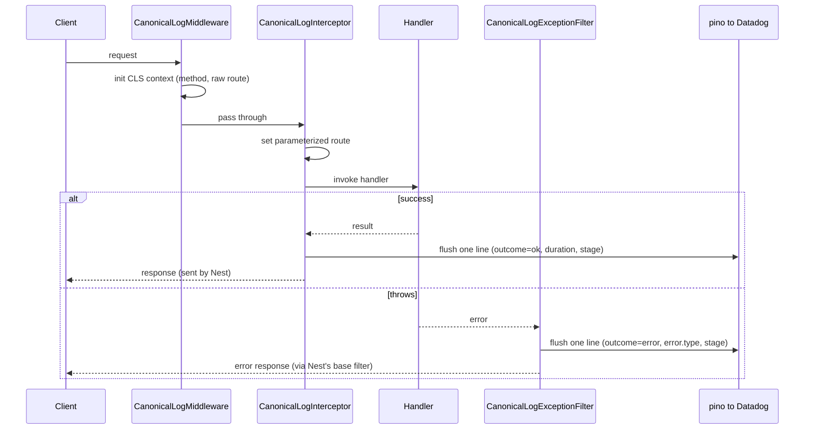

**Status:** Draft, under review
**Date:** 2026-07-06

---

## Summary

Observability is being able to answer questions about production from what the system already emits, including the ones we did not think to ask in advance. The lever is what each request records. Capture one rich event per request, carrying the fields that matter for our critical user journeys and business, and two kinds of question become answerable on the same data: **the ones we planned for, like error rate, latency, and SLOs, and the ones we did not, like which tenant's job updates fail at the write stage, or whether a latency spike on one route hits only one tenant.**
Metrics answer only the first, and only for the dimensions chosen up front. Getting the second needs two things we do not fully have today: a standard, intentional way to describe every request, and rich events, kept for every request, that we can query by any field.

We already emit a structured log line per request through `pino-http`, but it is built from the HTTP request alone: it has the route, status, tenant, and duration, but no domain context and no sense of where a request failed. The richer detail lives in APM traces, which are sampled to ***25*%** in production, so they answer per-request and per-tenant questions from a quarter of traffic. And there is no shared contract for what a request should record, so what handlers do log is random  and inconsistent.

This RFC proposes the canonical log line pattern, which gives us both: one structured JSON event per request, emitted on success and failure, enriched by the handler with typed domain fields and a `stage`, and kept for every request.

**Recommendation:** port `nestjs-canonical-log` into ProOne (`apps/server`) as an internal module and roll it out one module at a time. Its dependencies (`nestjs-cls`, `nestjs-pino`, Datadog) are already in the codebase, so the port is mostly wiring. Estimated 4 to 5 days to a validated pilot (section 11).

---

## 1. Problem

`pino-http` auto-logs one line when each response finishes; its shape is defined by the `customSuccessObject` / `customErrorObject` hooks in `apps/server/src/logger/logger.module.ts`.

*Here is that line on a failed job-status update:*

```json
{
  "level": "error",
  "message": "PATCH /api/jobs/:id/status 500 88ms",
  "correlationId": "01J...",
  "tenantKey": "acct_8f2c",
  "userId": "usr_20b7",
  "http": {
    "method": "PATCH",
    "path_pattern": "/api/jobs/:id/status",
    "status_code": 500
  },
  "error": "Unique constraint failed on the fields: (`status`)"
}
```

Every field comes from the HTTP layer. Nothing on the line says what the handler (the controller method serving the request) was attempting: which job, which state change, or how far it got before it threw. Three specific gaps follow:

- **No domain context.** The line has HTTP and identity fields but nothing domain-specific (`job.id`, a status transition, the entity involved), and handlers cannot add to it. Domain detail, if logged at all, goes into separate freeform `logger.log()` lines.
- **Domain logs are random and inconsistent.** What handlers do log goes into separate lines with no shared shape. The same concept appears as `tenantId`, `tenantKey`, or `tenant_id` across modules (all three occur in log calls in `apps/server/src` today), so a filter or dashboard built on one name silently misses the others.
- **No sense of where a failure happened.** On an error the line has the status and the error message, but not which step the handler reached. Diagnosing means reading breadcrumbs by hand or reproducing the request locally.

A canonical log line closes all three. It keeps everything this line already has and lets handlers enrich it: they attach typed domain fields and a `stage` to the same event, so one line carries HTTP, identity, domain context, and where it failed. The next section shows how.

---

## 2. Proposal: one event per request

Each request emits exactly one flat JSON line, on success or failure. This is the same idea Stripe named the *canonical log line* and the industry now calls a *wide event*: one rich event per request. The line carries request metadata, identity, timing, outcome, and any domain fields the handler recorded.

### Success

```json
{
  "service.name": "proone",
  "http.route": "/api/jobs/:id/status",
  "http.request.method": "PATCH",
  "http.response.status_code": 200,
  "duration_ms": 143,
  "outcome": "ok",
  "stage": "done",
  "tenant_id": "acct_8f2c",
  "actor_id": "usr_20b7",
  "actor_type": "human",
  "job.id": "job_99a1",
  "job.status_from": "scheduled",
  "job.status_to": "in_progress",
  "correlation_id": "01J..."
}
```

### Failure

The same line is emitted on the error path. Identity is present (the auth layer ran before the handler); domain fields that were never set are absent, and `stage` records where handling stopped:

```json
{
  "http.route": "/api/jobs/:id/status",
  "http.response.status_code": 500,
  "duration_ms": 88,
  "outcome": "error",
  "error.type": "PrismaClientKnownRequestError",
  "error.message": "Unique constraint failed on the fields: (`status`)",
  "stage": "writing_status",
  "tenant_id": "acct_8f2c",
  "actor_id": "usr_20b7",
  "actor_type": "human",
  "job.id": "job_99a1",
  "job.status_from": "scheduled"
}
```

`stage` is `writing_status` and `job.status_to` is absent, so you can see the request failed before the DB write committed without opening the handler. "Which stage fails most for a given tenant" becomes a single Datadog query.

### Outcome values

`outcome` distinguishes four cases, and dashboards should expect all four:

- `ok`: handler completed and a response was sent.
- `error`: something threw; `error.type` and `stage` say what and where.
- `timeout`: the request never finished. A TTL sweep (default 30s) emits the line with whatever fields accumulated, so hung requests stay visible instead of vanishing.
- `shutdown`: the request was still in flight when the app shut down (for example, force-closed at the end of a deploy's grace period). Separates deploy artifacts from real errors at query time.

### Request lifecycle



The interceptor and the exception filter share an idempotent emitted-once flag carried on the per-request record itself (the record lives in CLS, the request-scoped async context `nestjs-cls` provides), so exactly one line is emitted per request regardless of which path completes it. The flag living on the record rather than in CLS lookups is also what lets the TTL sweep and the shutdown hook emit safely from outside a request context.

### Handler usage

The handler sets fields and stages as it runs. Passing a module's own union types as generics checks field names and stage values at compile time, so typos and field-name drift are caught before they ship:

```tsx
type JobFields = {
  'job.id'?: string
  'job.status_from'?: string
  'job.status_to'?: string
}
type JobStage = 'fetching_job' | 'writing_status' | 'notifying' | 'done'

canonicalLog.stage<JobStage>('fetching_job')
canonicalLog.addFields<JobFields>({ 'job.id': id, 'job.status_from': job.status })

// after the write:
canonicalLog.stage<JobStage>('done')
canonicalLog.addFields<JobFields>({ 'job.status_to': next })
```

If a handler never sets a stage, the line carries the default `stage: "request_started"`. That default doubles as an adoption metric: grouping by route where `stage:"request_started"` lists the routes that have not been instrumented yet (section 9).

Identity is wired once in the auth layer, so every line carries it:

```tsx
canonicalLog.addFields({
  tenant_id: user.tenantId,
  actor_id: user.id,
  actor_type: 'human',
})
```

Each module defines its own field and stage types, so shared fields (tenant, actor, route, outcome) are set centrally while domain fields stay per-module.

### Error context on the failure line

The exception filter attaches error and request context to the failure line automatically, so handlers no longer need boilerplate `try/catch` that exists only to log the error with context:

```tsx
@Catch()
export class CanonicalLogExceptionFilter extends BaseExceptionFilter {
  constructor(private readonly canonicalLog: CanonicalLogService) {
    super()
  }

  catch(exception: unknown, host: ArgumentsHost) {
    const req = host.switchToHttp().getRequest<Request>()

    this.canonicalLog.addFields({
      'error.type': exception?.constructor?.name,   // exception class, queryable
      'error.message': getMessage(exception),        // message only, no stack
      // added in our port: a whitelisted request slice
      'http.request.params': req.params,
      'request.body_keys': Object.keys(req.body ?? {}), // shape, not contents
    })
    this.canonicalLog.flush()     // idempotent; no-op if the line already went out
    super.catch(exception, host)  // Nest's default handler sends the HTTP response
  }
}
```

Every error now produces a complete line without the handler writing any logging code: the error type and message, the stage it reached, the domain fields set before it threw, and, added in our port, two safe pieces of the request: the route params, and the body's key names (its shape, never its contents). When a handler wants a custom message or extra context, it adds it with `canonicalLog.addFields(...)` rather than a separate `logger.error(...)`; the fields survive the throw and land on the same line.

Concretely, the granular try/catch blocks we keep adding around individual steps, whose real job is diagnosis (knowing which step failed and logging its local context), go away: `stage()` and `addFields()` carry that instead.

```tsx
// before: try/catch that exists only to log context
try {
  await this.jobs.updateStatus(id, next)
} catch (error) {
  this.logger.error('failed to update job status', {
    jobId: id,
    from: job.status,
    to: next,
  })
  throw error
}
```

becomes:

```tsx
// after: record context as you go; the logging-only try/catch is gone
canonicalLog.stage<JobStage>('writing_status')
canonicalLog.addFields<JobFields>({ 'job.id': id, 'job.status_from': job.status })
await this.jobs.updateStatus(id, next)
// if this throws, the filter emits the line already carrying
// job.id, job.status_from, stage, and the error type and message
```

This also makes coarse-grained error handling better, not worse. A catch-all used to lose the "where did it fail" information, which is exactly what pushed us toward a catch per step; now `stage` preserves it, so a handler can rely on one generic path (or none, letting the global filter do the work) without losing diagnostic detail. Try/catch remains only where it changes behavior: recovering, rolling back, or mapping the error to a specific `HttpException`.

---

## 3. Why not spans?

We already run dd-trace, so the fair first question is: why not tag the request span with `tenant_id`, `stage`, and domain fields and query them in Datadog APM, instead of adding a separate log line?

The deciding factor is completeness. **Our spans are already sampled:** in production we initialize ***dd-trace*** at a **25%** sample rate (`apps/server/src/lib/tracer.ts:11`; 50% outside production), and Datadog's own default is a sampled target of about 10 traces per second per Agent (Ingestion Controls). So a `stage` or `tenant_id` group-by over spans today runs on roughly a quarter of requests. For per-request triage ("what happened to *this* request?"), the span is usually not there.

**Putting all the same fields on one rich span does not escape this.** It is still an APM span, so it rides the same sampler and is still dropped about 75% of the time in production. Sampling is a property of the APM pipeline, not of how many spans you emit. Moving the event onto log management is what takes it off the trace sampler.

**Making spans equivalent means owning a fragile config chain.** You would need to force 100% trace ingestion (paying for the extra volume), plus a correctly scoped span-level retention filter at 100%. Per indexed event the two are priced the same, so a span-level filter keeps one span per request at parity with one canonical line (Datadog Trace Retention distinguishes span-level from trace-level filters). A trace-level filter instead pulls in the whole trace and multiplies indexed volume by its width, which is where the "spans are expensive" folklore comes from. Both are Datadog dashboard config, both drift silently, and getting either wrong breaks completeness with no error to tell you.

**A canonical line is guaranteed in code, not configured.** One event per request, emitted on success and error, enforced by the interceptor, the exception filter, and an idempotent flush. The guarantee lives in code we own and review in PRs, not in retention filters someone has to keep correct.

This does not replace tracing. Spans remain the right tool for the distributed call graph and cross-service waterfalls, and the field names here follow OpenTelemetry conventions so canonical logs and tracing run alongside each other. The pattern automates the logger, not the log database: it produces one rich event per request; Datadog stores and queries it.

---

## 4. Why not just do this with nestjs-pino?

The second fair question, since we already run nestjs-pino and it has a primitive for this: `logger.assign({...})` adds fields to the request-scoped logger, and with `assignResponse: true` those fields also land on pino-http's completion line. That covers the accumulation half of the pattern: a handler could `assign` a `job.id` and a hand-rolled `stage` today and they would appear on the existing line.

What `assign()` does not give is the other half, which is exactly what section 1 identifies as the problem:

- **A contract instead of a convention.** `assign()` takes `Record<string, any>`: no typed fields, no stage enum, nothing preventing the `tenantId` / `tenantKey` / `tenant_id` drift we already have. `addFields<T>()` and `stage<T>()` are checked at compile time.
- **Every exit path covered.** pino-http logs when the response finishes. A request that never finishes (hung handler, stuck upstream call) emits nothing, forever; a request in flight during shutdown emits nothing. The module adds `outcome: "timeout"` via a TTL sweep and `outcome: "shutdown"` via a shutdown hook, so every started request produces a line.
- **Protected internals and exactly-once.** The emitted-once flag and the start timestamp live on Symbol keys that application code cannot reach; `assign()` can overwrite anything, including the fields dashboards depend on.
- **Semantics in reviewable code.** `outcome`, `stage`, and monotonic `duration_ms` live in three small classes reviewed in PRs, instead of accumulating inside `customSuccessObject` / `customErrorObject` config hooks.

The honest framing: the module *is* this idea done with nestjs-pino. It uses pino as its sink and adds the few hundred lines of contract and failure-path guarantees that `assign()` leaves to convention. Closing those gaps inside logger config would mean reimplementing the same module, spread across hooks where nobody reviews it as a unit.

**Alternative considered: a typed wrapper over `assign()`.** A ~20-line injectable wrapping `assign()` with the same `addFields<T>()` / `stage<T>()` generics would fix the contract half (typed fields, naming drift) at minimal cost. What it cannot fix is *when* the line is emitted: emission belongs to pino-http's response-finish event, and no wrapper around field-writing changes that. Hung requests and shutdown-interrupted requests would still emit nothing, which is exactly the completeness gap section 3 argues against. Adding those paths requires tracking in-flight requests with an independent emission clock and an emitted-once flag, at which point the wrapper has grown into the module. Viable as a phase 0 if we only want typing and accept today's blind spots; not a substitute.

**Verified against the reference example** (a handler stuck on a never-settling await, pino-http v8 with auto-logging on):

- Client keeps waiting (no one closes the connection): pino-http emits nothing, indefinitely. The request does not exist in the logs.
- Client or LB gives up (connection closes): pino-http emits `request aborted` with `statusCode: null` and a `responseTime` equal to the client's patience. No route template, no domain fields, no indication of what the handler was doing. The timing is owned by whoever hung up, not by us.
- The canonical module emitted `outcome: "timeout", stage: "calling_dead_api"` with route and identity in both cases, on its own clock (the TTL), independent of whether or when the connection closed.

So a hung request is at best a context-free "aborted" line whose timing we do not control, and at worst invisible. The canonical line is the only one of the three that says where the request was stuck.

---

## 5. Fit with the existing stack

Almost everything the pattern needs is already in the codebase, so the work is mostly wiring:

- **Request-scoped context:** `nestjs-cls` is mounted globally (`ClsModule.forRoot` in `main.module.ts`). We verify during wiring that it is mounted in middleware mode (`middleware: { mount: true }`) and runs before the canonical middleware; that ordering is the module's one hard prerequisite (it warns once and disables itself if unmet, rather than failing requests).
- **Structured JSON logger:** `nestjs-pino` and `src/logger`; canonical output routes through an adapter over it.
- **Datadog pipeline:** pino JSON already ships to Datadog, with correlation and trace ids already injected.

What we add is three small classes:

- **`CanonicalLogMiddleware`:** starts the per-request context.
- **`CanonicalLogInterceptor`:** sets the route and flushes the line on success (can absorb the `api.error.<status>` counter that our current `LoggingInterceptor` increments when a handler throws with status 400+).
- **`CanonicalLogExceptionFilter`:** flushes the line on error.

---

## 6. Performance

Benchmarked in the reference repo. Under a realistic workload (a handler doing ~50 ms of I/O), the overhead is within noise: throughput and p50 are unchanged versus pino alone, and the fixed per-request cost is 1 to 3 ms of CPU that real handler work dwarfs. Methodology and numbers are in the repo's `benchmarks/`; we confirm on our own hardware during the pilot.

---

## 7. Cost and impact

- **Same unit price as a span, kept for every request.** Per indexed event, Datadog prices a canonical log line and an APM span the same (section 3). The difference is coverage: unlike our 25% sampled traces, the canonical line is kept for every request.
- **Event-count neutral; bytes per line grow.** We already emit one structured line per request through `pino-http`, so the canonical line replaces that line rather than adding a new one. The replacement carries more fields, so we expect bytes per line up roughly 2 to 3x on instrumented routes while the indexed event count stays flat. During the pilot the two lines run in parallel, so volume temporarily doubles on piloted routes until step 5 of the rollout consolidates them. We confirm the net ingested-byte and indexed-event change on the pilot before broad rollout.
- **An accurate source for metrics and alerts.** Because every request emits one line and none are sampled (unless a Datadog exclusion filter is configured on the log index), metrics derived from canonical logs (request counts, error rate, latency percentiles, grouped by tenant, route, or stage) are computed from every request, not estimated from a 25% span sample. Monitors and SLOs built on them reflect real traffic.
- **Ad-hoc queries.** Each request becomes one filterable, groupable event, so questions like slowest routes by tenant, error rate by stage, or outcome by actor type are single queries over every request.
- **Migration path to tracing.** Field names follow OpenTelemetry semantic conventions (`http.route`, `http.response.status_code`, `service.name`, and so on), so most fields map onto spans without renaming if we later adopt OTEL tracing.

---

## 8. Vendor vs. npm dependency

The recommendation is to copy the code into the monorepo as an internal module rather than add the published package.

- **Control.** We can adapt the logger adapter, field contract, and redaction to our setup and evolve them with the codebase.
- **No external coupling.** The reference library is single-maintainer. Vendoring removes it as a supply-chain and continuity dependency on a core observability path.
- **Small surface.** A few small classes and a service, inexpensive to review, test, and maintain in-repo.

Vendoring means the copy diverges freely: we do not track upstream releases, and fixes flow in only if we choose to port them. The reference repo remains as documentation and provenance; the vendored copy is ours.

Alternative considered: **use the npm package directly.** Faster to start, but couples a core path to an external personal dependency and its release cadence. Not recommended.

---

## 9. Rollout plan

Each step is independently shippable and reversible.

1. **Port the module** into `apps/server` (for example `src/observability/canonical-log/`), with an adapter over the existing pino logger. Add tests for single emission on both success and error paths. Verify the middleware wildcard syntax against our Nest major (Nest 11 / Express 5 rejects the bare `'*'` pattern; it needs `'{*splat}'`).
2. **Wire it up passively.** Register the middleware, interceptor, and filter, and wire identity in the auth layer. Verify the CLS mount order (section 5). Keep the existing error metric in parallel; remove nothing yet.
3. **Pilot one module** (proposed: jobs / appointments, being one of our most critical user journeys: high-traffic and clearly tenant-scoped). Add `stage()` and `addFields()` calls, build a Datadog dashboard on the new line, confirm it answers real on-call questions, and record the real latency overhead (section 6) and log-volume delta (section 7) on our hardware.
4. **Establish the field contract** as a lightweight review check: new domain field names must be typed and OTEL-aligned, and each module's fields and stages should come from its critical user journeys, recording what we would need to answer questions about that journey in production. Document them in one field reference.
5. **Expand module by module, then consolidate.** Track adoption with the built-in metric: routes still emitting `stage: "request_started"` have not been instrumented. Once coverage is broad, replace `pino-http`'s per-request auto-log with the canonical line so we emit one line per request, not two, and retire the boilerplate error logging it makes unnecessary.

---

## 10. Risks and trade-offs

- **HTTP requests only.** The middleware, interceptor, and filter are HTTP-scoped, so cron jobs, Bull queue workers, and other non-HTTP entrypoints emit no canonical line and keep their current logging. Extending the pattern to background work (a CLS-scoped wrapper around a job run) is possible but out of scope here.
- **PII and redaction.** The pattern does not redact by design; that is delegated to the logger config. The error filter attaches a whitelisted slice of the request (params and body keys), never the raw body. Before broad rollout we identify sensitive fields and configure pino redaction. This is a prerequisite for the pilot.
- **Cardinality.** Raw ids belong in the log line but must not become metric tags. The typed API reduces the chance of this, but the rule should be documented.
- **Depends on instrumentation discipline.** The value scales with how thoroughly handlers set `stage()` and domain fields. Under-instrumented handlers still produce a useful baseline line (and are visible via the `request_started` adoption metric, section 9), but the fuller payoff requires developer habit, which is why rollout is gradual.
- **Maintenance ownership.** Once vendored, we own it. The surface is small, but it needs a named owning team.

---

## 11. Effort estimate

One engineer familiar with the server, to a validated pilot:

| Work                                                        | Estimate         |
| ----------------------------------------------------------- | ---------------- |
| Port module and logger adapter                              | ~1 day           |
| Tests (single emission on success and error, CLS lifecycle) | ~1 day           |
| Global wiring and identity in auth, running passively       | ~0.5 day         |
| Pilot instrumentation (one module) and Datadog dashboard    | ~1 to 2 days     |
| PII / redaction config and field reference                  | ~0.5 day         |
| **Total**                                                   | **~4 to 5 days** |

Expansion after that is incremental and can proceed in parallel across teams.

---

## 12. Open questions

1. Should the canonical line replace the current `api.error.*` metric, or should both run indefinitely?
2. When a module is piloted, do its existing freeform `logger.log()` calls get deleted in the same PR that instruments it, or left until the step-5 consolidation? (Leaving it ambiguous means both answers happen.)

---

## References

- **Reference implementation:** https://github.com/mohamed-elfiky/nestjs-canonical-log
- **Canonical log line origin:** Stripe, Fast and flexible observability with canonical log lines (Brandur Leach).
- **Wide events:** Observability Is About Asking Any Question.
